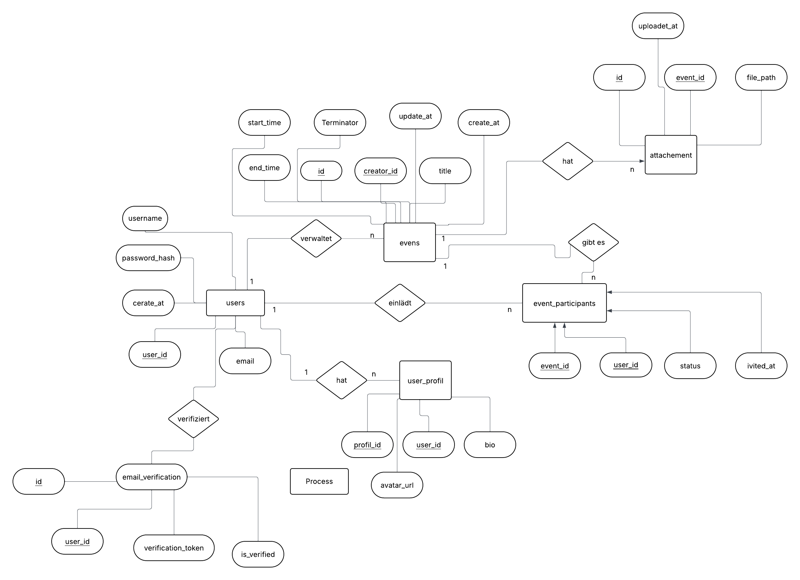
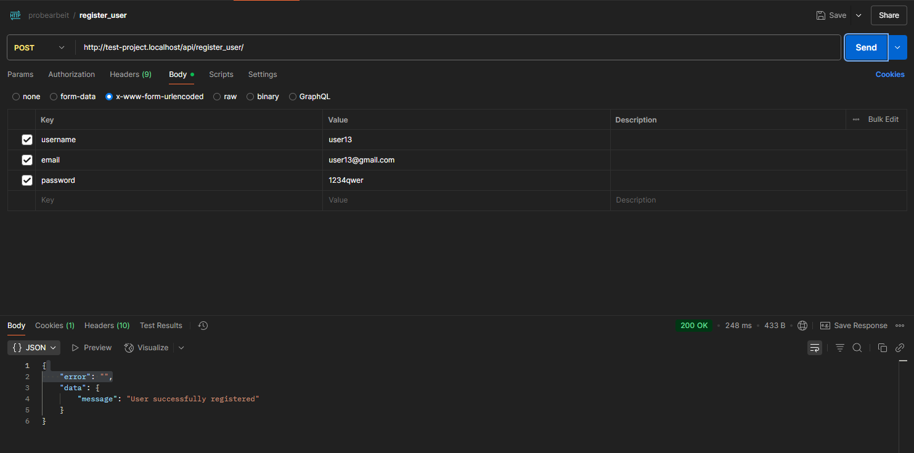

## plugin documentations
* routing: https://github.com/skipperbent/simple-php-router
* .env support: https://github.com/vlucas/phpdotenv
* crypto: https://github.com/defuse/php-encryption
* database:
  * https://github.com/illuminate/database
  * https://laravel.com/docs/9.x/database

## setup
* change package name in composer.json
* copy ``.env.example`` to ``.env`` and enter your settings
* run ``composer install`` to get all dependencies
* if you cloned this from git, remove the .git folder and make a seperate repository for your project
* setup your webserver to use the "/public" directory as the main directory (example vhost config for apache on xampp):
```
<VirtualHost *:80>
    ServerName project.localhost
    DocumentRoot C:\xampp\htdocs\project\public
</VirtualHost>
```

# Projektdokumentation

## Zu bearbeitende Aufgaben

Ziel ist es, eine API zu entwickeln. Die API soll Schnittstellen zur Verfügung stellen, um Termine zu verwalten.
Folgende Anwendungsfälle sollen implementiert werden:

Benutzer registrieren/anmelden:
- Registrierung
  - Benutzername
  - E-Mail
  - Passwort
- Anmeldung/Abmeldung
- AuthMiddleware anpassen um zu prüfen, ob ein User eingeloggt ist

Terminverwaltung (für angemeldete Benutzer):
- Termin anlegen
  - Beschreibung zum Termin
  - Zeitraum
  - Anhang (File Upload)
  - Benutzer einladen
- Termin löschen
- Termin aktualisieren
- Termine anzeigen

Folgende Funktionen sind optional:
- Benutzerprofil anzeigen
- Benutzerprofil bearbeiten
- Benutzer Einladung zum Termin annehmen/ablehnen
- Verifizierung (E-Mail)

**Datenbank: An die API soll eine MariaDB Datenbank angebunden werden. Die Struktur der Datenbank sollst du dabei selber aufbauen.**

**Das Versionsmanagement soll über Git erfolgen**
---

## Datenbank

Der erste Schritt zur erfolgreichen Umsetzung dieses Projekts ist die Entwicklung eines durchdachten und stabilen Datenbankmodells. Eine gut strukturierte und normalisierte Datenbank erleichtert nicht nur die Wartung und Weiterentwicklung des Projekts, sondern beugt auch Dateninkonsistenzen vor.

Nachfolgend das Entity-Relationship-Modell (ERM), das die für dieses Projekt genutzte Datenbankstruktur abbildet:


### Tabellenübersicht

* **`users`**: Enthält grundlegende Informationen zu den Nutzerkonten wie E-Mail-Adresse, gehashte Passwörter und eindeutige Identifikatoren.

* **`events`**: Beinhaltet die von den Nutzern erstellten Veranstaltungen. Die Spalte `user_id` verweist auf den Ersteller des Events. Bei Löschung eines Nutzers werden dessen Events automatisch mit entfernt (Cascade Delete).

* **`event_participants`**: Dient der Verknüpfung mehrerer Teilnehmer mit einem Event. Die Tabelle besteht aus den Fremdschlüsseln `event_id` und `user_id`, die zusammen den Primärschlüssel bilden. So wird sichergestellt, dass ein Nutzer nicht mehrfach für dasselbe Event eingetragen werden kann.

* **`attachments`**: Erlaubt es, eine Datei einem Event zuzuordnen. Zur Vereinfachung ist pro Event nur ein Anhang vorgesehen.

* **`user_profile`**: Speichert zusätzliche Informationen zum Nutzer, wie Profilbild, Kurzbiografie usw.

* **`email_verification`**: Verwal­tet den Verifizierungsstatus der E-Mail-Adressen. So lässt sich nachvollziehen, ob ein Nutzer seine Adresse bestätigt hat.

---

## Benutzerregistrierung

* **API-Endpunkt**: `http://test-project.localhost/api/register_user/`

Die erste umgesetzte Funktionalität ist die Benutzerregistrierung. Benötigte Felder: `username`, `email`, `password`.
Vor dem Anlegen eines Kontos wird geprüft, ob E-Mail oder Benutzername bereits verwendet werden.

### Fehlermeldungen

* Ist die E-Mail-Adresse oder der Benutzername bereits vergeben, erfolgt eine Fehlermeldung:
  *(Hier ein Beispiel für eine JSON-Fehlermeldung einfügen)*

* Auch bei einem zu kurzen Passwort oder einer ungültigen E-Mail-Adresse wird eine Fehlermeldung zurückgegeben:
  *(Hier ein Beispiel für eine JSON-Fehlermeldung einfügen)*

### Validierung und Speicherung

Sind alle Eingaben gültig:

* Wird das Passwort vor der Speicherung gehasht.
* Ein neues Nutzerkonto wird erstellt.
* Anschließend kann sich der Nutzer mit seinen Zugangsdaten anmelden.



Beispielhafter Bash-Befehl (generiert mit Postman):
```bash
curl --location 'http://test-project.localhost/api/register_user/' \
--header 'Content-Type: application/x-www-form-urlencoded' \
--header 'Cookie: PHPSESSID=pbp6noum63bj6su8u7mok0t5cn' \
--data-urlencode 'username=user14' \
--data-urlencode 'email=user14@gmail.com' \
--data-urlencode 'password=1234qwer'
```

---

## Anmeldung (Login)

* **API-Endpunkt**: `http://test-project.localhost/api/login`

Nach erfolgreicher Registrierung kann sich der Nutzer anmelden.
Der Ablauf ist wie folgt:

1. Der Nutzer gibt seine E-Mail-Adresse und sein Passwort ein.
2. Das übermittelte Passwort wird gehasht und mit dem in der Datenbank gespeicherten verglichen.
3. Sind die Angaben korrekt, generiert der Server ein **JWT-Token**.
4. Dieser Token wird an den Client zurückgegeben und dient zur Authentifizierung bei zukünftigen Anfragen.

🕒 **Gültigkeitsdauer des Tokens**: 1 Stunde
*(Hier ein Screenshot eines erfolgreichen Logins einfügen)*

Beispielhafter Bash-Befehl:

```bash
curl --location 'http://test-project.localhost/api/create_event?creator_id=1' \
--form 'title="Projektsitzung"' \
--form 'description="Besprechung der Funktionen"' \
--form 'start_date="2025-06-01 10:00:00"' \
--form 'end_date="2025-06-01 12:00:00"' \
--form 'participants="2,3,4"' \
--form 'attachment=@"/pfad/zur/datei.pdf"'
```

---

## Abmeldung (Logout)

* **API-Endpunkt**: `http://test-project.localhost/api/logout` *(optional)*

Für die Abmeldung sind keine Serveraktionen erforderlich.
Die Abmeldung erfolgt clientseitig, indem der zuvor gespeicherte **JWT-Token** (z. B. im `localStorage`) gelöscht wird.


---

## Erstellung eines Events

**API-Endpunkt:** `http://test-project.localhost/api/create_event`

Nach dem Login kann der Benutzer ein Event erstellen. Die Angabe der `creator_id` (ID des Erstellers) ist zwingend erforderlich und muss über die URL-Parameter übermittelt werden, z. B.: `?creator_id=5`.

> 💡 *Hinweis: In einem realen Projekt würde diese ID in der Regel automatisch aus der Sitzung oder dem JWT-Token ermittelt. Hier wird sie zur Vereinfachung manuell übergeben.*

### Voraussetzungen für die Erstellung:

* Die angegebene `creator_id` muss zu einem existierenden Benutzer in der Datenbank gehören. Ist dies nicht der Fall, wird ein Fehler zurückgegeben.
* Es muss mindestens ein Teilnehmer zum Event eingeladen werden. Der Ersteller kann sich selbst einladen.
* Jeder eingeladene Teilnehmer muss in der Datenbank existieren. Andernfalls wird ein Fehler ausgegeben.
* Es kann **eine einzelne PDF-Datei** an das Event angehängt werden:

  * Die Datei wird beim Hochladen umbenannt und auf dem Server gespeichert – Format: `event_id_[attachment.pdf]`.
  * Der Speicherpfad wird in der Datenbank hinterlegt.
* Es müssen ein **Startdatum** und ein **Enddatum** angegeben werden.

  * Das Startdatum muss vor dem Enddatum liegen.

#### Beispiel (cURL-Anfrage):

```bash
curl --location 'http://test-project.localhost/api/create_event?creator_id=1' \
--form 'title="Projektbesprechung"' \
--form 'description="Diskussion der Funktionalitäten"' \
--form 'start_date="2025-06-01 10:00:00"' \
--form 'end_date="2025-06-01 12:00:00"' \
--form 'participants="2,3,4"' \
--form 'attachment=@"/pfad/zur/datei.pdf"'
```

---

## Löschen eines Events

**API-Endpunkt:** `http://test-project.localhost/api/delete_event`

Authentifizierte Benutzer können ein Event löschen. Dabei gilt:

* Eine eventuell angehängte Datei wird ebenfalls vom Server entfernt, und der Dateipfad wird aus der Datenbank gelöscht.
* Die `event_id` muss im Body der Anfrage mitgesendet werden.
* Falls das Event nicht existiert, wird eine Fehlermeldung zurückgegeben.

#### Beispiel (cURL-Anfrage):

```bash
curl --location --request POST 'http://test-project.localhost/api/delete_event' \
--header 'Authorization: Bearer [JWT_TOKEN]' \
--form 'event_id=12'
```

---

## Bearbeiten eines Events

**API-Endpunkt:** `http://test-project.localhost/api/update_event`

Authentifizierte Benutzer können bestehende Events bearbeiten:

* Titel, Beschreibung, Datum usw. können aktualisiert werden.
* Neue Teilnehmer können hinzugefügt werden (sofern sie in der Datenbank existieren).
* Die Anhänge können aktualisiert oder ersetzt werden (nur PDF-Dateien erlaubt).

> 💡 *Es wird eine POST-Anfrage verwendet (statt PUT oder PATCH), um Dateiübertragungen mit `multipart/form-data` zu ermöglichen.*

#### Beispiel (cURL-Anfrage):

```bash
curl --location --request POST 'http://test-project.localhost/api/update_event' \
--header 'Authorization: Bearer [JWT_TOKEN]' \
--form 'event_id=12' \
--form 'title="Neuer Titel"' \
--form 'participants="5,6"' \
--form 'attachment=@"/neuer/pfad/zur/datei.pdf"'
```

---

## Abrufen eines Events

**API-Endpunkt:** `http://test-project.localhost/api/get_event`

Authentifizierte Benutzer können Event-Informationen auf zwei Arten abrufen:

* Über `event_id`: Details eines bestimmten Events.
* Über `creator_id`: Alle Events eines bestimmten Erstellers.

Zurückgegeben werden u. a.:

* Titel, Beschreibung, Ersteller
* Teilnehmerliste
* Anhang (falls vorhanden)
* Start- und Enddatum

#### Beispiel (cURL-Anfrage):

```bash
curl --location 'http://test-project.localhost/api/get_event?event_id=12' \
--header 'Authorization: Bearer [JWT_TOKEN]'
```


